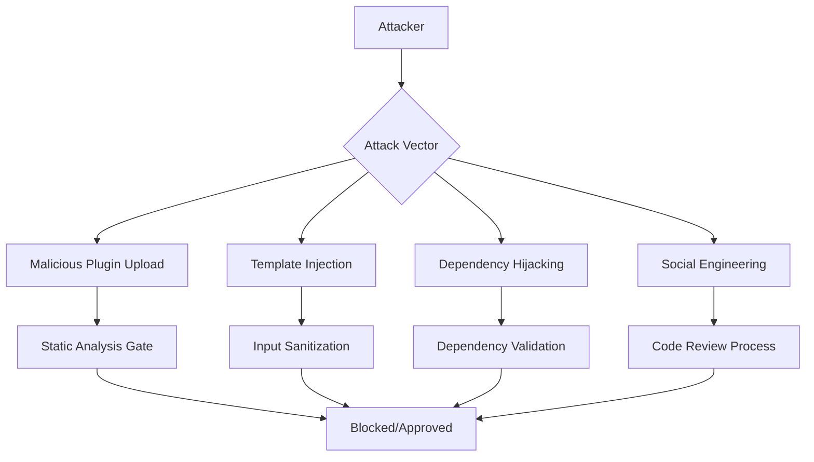

# Plugin Security Model

**Context:** Understanding the security architecture that protects users while enabling powerful plugin functionality  
**Audience:** Security-conscious developers and administrators  
**Purpose:** Explain the comprehensive security approach for plugin execution

The plugin security model in the Cursor Prompt Template Engine represents a careful balance between functionality and safety. This document explains the design principles, implementation details, and security guarantees of our plugin architecture.

## Design Philosophy

### Security by Design

The plugin system was built with security as a foundational requirement, not an afterthought. Every aspect of plugin execution operates under the principle of **least privilege** - plugins receive only the minimum permissions necessary to perform their intended function.

```
Traditional Plugin Model:
Plugin → Full System Access → High Risk

Our Security Model:
Plugin → Sandbox → Permission Gates → Limited System Access → Controlled Risk
```

### Defense in Depth

Multiple security layers work together to protect against various threat vectors:

1. **Static Analysis** - Code examination before execution
2. **Sandbox Isolation** - Runtime environment restrictions  
3. **Permission System** - Explicit capability grants
4. **Resource Limits** - Prevent resource exhaustion
5. **Behavior Monitoring** - Real-time security enforcement
6. **Audit Logging** - Complete activity tracking

## Threat Model

### Identified Risks

The plugin system is designed to protect against these security threats:

#### Malicious Plugins
- **File System Attacks**: Unauthorized file access, data exfiltration, file corruption
- **Network Attacks**: Unauthorized outbound connections, data theft
- **Code Injection**: Executing malicious code through template injection
- **Privilege Escalation**: Attempting to gain higher system privileges

#### Compromised Plugins
- **Supply Chain Attacks**: Legitimate plugins modified with malicious code
- **Dependency Confusion**: Malicious packages masquerading as dependencies
- **Update Attacks**: Malicious updates to previously safe plugins

#### Accidental Security Issues
- **Resource Exhaustion**: Memory leaks, infinite loops, excessive CPU usage
- **Data Exposure**: Accidentally logging sensitive information
- **Configuration Errors**: Misconfigured permissions leading to security gaps

### Attack Vectors



## Security Architecture

### Sandbox Implementation

The plugin sandbox creates an isolated execution environment using Node.js VM contexts with additional security controls:

```javascript
const vm = require('vm');
const { performance } = require('perf_hooks');

class PluginSandbox {
  constructor(permissions) {
    this.permissions = permissions;
    this.resourceMonitor = new ResourceMonitor();
    this.behaviorAnalyzer = new BehaviorAnalyzer();
  }
  
  createSecureContext(plugin) {
    // Create limited global environment
    const sandbox = {
      // Safe globals only
      console: this.createSandboxedConsole(plugin.name),
      setTimeout: this.createSandboxedTimeout(),
      setInterval: this.createSandboxedInterval(),
      
      // Controlled require function
      require: this.createSecureRequire(this.permissions.modules),
      
      // Plugin API access
      api: this.createSecureAPI(plugin.name, this.permissions),
      
      // No access to dangerous globals
      process: undefined,
      global: undefined,
      Buffer: undefined,
      eval: undefined,
      Function: undefined,
    };
    
    // Create VM context with security restrictions
    const context = vm.createContext(sandbox, {
      name: `plugin-${plugin.name}`,
      codeGeneration: {
        strings: false,  // Disable eval-like functions
        wasm: false      // Disable WebAssembly
      }
    });
    
    return context;
  }
  
  executePlugin(plugin, code, timeout = 5000) {
    const startTime = performance.now();
    const context = this.createSecureContext(plugin);
    
    try {
      // Monitor resource usage
      this.resourceMonitor.start(plugin.name);
      
      // Execute with timeout and resource limits
      const result = vm.runInContext(code, context, {
        timeout: timeout,
        breakOnSigint: true,
        displayErrors: false
      });
      
      // Analyze behavior
      const executionTime = performance.now() - startTime;
      this.behaviorAnalyzer.record(plugin.name, {
        executionTime,
        memoryUsed: this.resourceMonitor.getMemoryUsage(plugin.name),
        apiCalls: this.resourceMonitor.getAPICalls(plugin.name)
      });
      
      return result;
      
    } catch (error) {
      this.handleSecurityViolation(plugin.name, error);
      throw error;
    } finally {
      this.resourceMonitor.stop(plugin.name);
    }
  }
}
```

### Permission System

#### Permission Categories

The permission system uses fine-grained capability grants across several categories:

```typescript
interface PluginPermissions {
  fileSystem: {
    read: string[];      // Readable paths/patterns
    write: string[];     // Writable paths/patterns
    execute: string[];   // Executable file access
  };
  
  network: {
    outbound: string[];  // Allowed outbound hosts
    ports: number[];     // Allowed port access
  };
  
  system: {
    commands: string[];  // Allowed system commands
    environment: {
      read: string[];    // Readable env variables
      write: string[];   // Writable env variables
    };
  };
  
  api: {
    templates: boolean;  // Template API access
    marketplace: boolean; // Marketplace API access
    user: boolean;       // User data access
  };
  
  resources: {
    maxMemory: number;   // Memory limit (bytes)
    maxCPUTime: number;  // CPU time limit (ms)
    maxFileSize: number; // Max file operation size
  };
}
```

#### Permission Validation

```typescript
class PermissionValidator {
  validateFileAccess(plugin: string, path: string, operation: 'read' | 'write') {
    const permissions = this.getPluginPermissions(plugin);
    const allowedPaths = permissions.fileSystem[operation];
    
    // Check path against allowed patterns
    const isAllowed = allowedPaths.some(pattern => {
      return minimatch(path, pattern) && this.isSecurePath(path);
    });
    
    if (!isAllowed) {
      this.logSecurityViolation(plugin, 'FILE_ACCESS_DENIED', { path, operation });
      throw new SecurityError(`Plugin ${plugin} denied access to ${path}`);
    }
  }
  
  validateNetworkAccess(plugin: string, host: string, port: number) {
    const permissions = this.getPluginPermissions(plugin);
    
    // Check against allowed hosts
    const hostAllowed = permissions.network.outbound.includes(host) ||
      permissions.network.outbound.includes('*');
    
    // Check against allowed ports
    const portAllowed = permissions.network.ports.includes(port) ||
      permissions.network.ports.includes(0); // 0 = any port
    
    if (!hostAllowed || !portAllowed) {
      this.logSecurityViolation(plugin, 'NETWORK_ACCESS_DENIED', { host, port });
      throw new SecurityError(`Plugin ${plugin} denied network access to ${host}:${port}`);
    }
  }
  
  isSecurePath(path: string): boolean {
    // Prevent directory traversal
    if (path.includes('../') || path.includes('..\\')) {
      return false;
    }
    
    // Prevent access to sensitive system files
    const deniedPatterns = [
      '/etc/passwd', '/etc/shadow',
      '/.ssh/', '/id_rsa', '/id_ed25519',
      'C:\\Windows\\System32\\',
      '*.key', '*.pem', '*.p12'
    ];
    
    return !deniedPatterns.some(pattern => minimatch(path, pattern));
  }
}
```

### Static Code Analysis

Before any plugin is executed, it undergoes comprehensive static analysis:

#### Security Rule Engine

```typescript
class SecurityRuleEngine {
  private rules: SecurityRule[] = [
    {
      id: 'no-eval',
      pattern: /\b(eval|Function)\s*\(/,
      severity: 'critical',
      message: 'Direct code execution functions are prohibited'
    },
    {
      id: 'no-file-system-bypass',
      pattern: /require\s*\(\s*['"`]fs['"`]\s*\)/,
      severity: 'critical',
      message: 'Direct filesystem access is prohibited'
    },
    {
      id: 'no-child-process',
      pattern: /require\s*\(\s*['"`]child_process['"`]\s*\)/,
      severity: 'critical',
      message: 'Process spawning is prohibited'
    },
    {
      id: 'no-network-bypass',
      pattern: /require\s*\(\s*['"`](http|https|net)['"`]\s*\)/,
      severity: 'high',
      message: 'Direct network access is prohibited'
    }
  ];
  
  analyzeCode(code: string, pluginName: string): SecurityAnalysisResult {
    const violations = [];
    const ast = this.parseAST(code);
    
    // Pattern-based analysis
    this.rules.forEach(rule => {
      if (rule.pattern.test(code)) {
        violations.push({
          rule: rule.id,
          severity: rule.severity,
          message: rule.message,
          location: this.findLocation(code, rule.pattern)
        });
      }
    });
    
    // AST-based analysis
    violations.push(...this.analyzeAST(ast, pluginName));
    
    // Dependency analysis
    violations.push(...this.analyzeDependencies(ast, pluginName));
    
    return {
      passed: violations.filter(v => v.severity === 'critical').length === 0,
      violations,
      risk_score: this.calculateRiskScore(violations)
    };
  }
  
  analyzeAST(ast: Node, pluginName: string): SecurityViolation[] {
    const violations = [];
    
    traverse(ast, {
      // Detect dynamic require calls
      CallExpression(path) {
        if (path.node.callee.name === 'require' && 
            !path.node.arguments[0].type === 'StringLiteral') {
          violations.push({
            rule: 'dynamic-require',
            severity: 'high',
            message: 'Dynamic require calls are not allowed',
            location: path.node.loc
          });
        }
      },
      
      // Detect global variable access
      MemberExpression(path) {
        if (path.node.object.name === 'global' || 
            path.node.object.name === 'process') {
          violations.push({
            rule: 'global-access',
            severity: 'high',
            message: 'Access to global objects is restricted',
            location: path.node.loc
          });
        }
      }
    });
    
    return violations;
  }
}
```

### Runtime Behavior Monitoring

#### Anomaly Detection

```typescript
class BehaviorAnalyzer {
  private baselines = new Map<string, PluginBaseline>();
  private anomalyDetector = new AnomalyDetector();
  
  record(pluginName: string, metrics: ExecutionMetrics) {
    const baseline = this.baselines.get(pluginName);
    
    if (!baseline) {
      // Establish baseline for new plugin
      this.baselines.set(pluginName, {
        avgExecutionTime: metrics.executionTime,
        avgMemoryUsage: metrics.memoryUsed,
        avgAPICalls: metrics.apiCalls.length,
        executionCount: 1
      });
      return;
    }
    
    // Detect anomalies
    const anomalies = this.anomalyDetector.detect(metrics, baseline);
    
    if (anomalies.length > 0) {
      this.handleAnomalies(pluginName, anomalies);
    }
    
    // Update baseline
    this.updateBaseline(pluginName, metrics);
  }
  
  handleAnomalies(pluginName: string, anomalies: Anomaly[]) {
    anomalies.forEach(anomaly => {
      switch (anomaly.type) {
        case 'execution_time_spike':
          if (anomaly.severity > 0.8) {
            this.emergencyStop(pluginName, 'Execution time anomaly detected');
          }
          break;
          
        case 'memory_leak':
          if (anomaly.severity > 0.9) {
            this.emergencyStop(pluginName, 'Memory leak detected');
          }
          break;
          
        case 'api_abuse':
          this.rateLimitPlugin(pluginName);
          break;
      }
      
      this.logSecurityEvent(pluginName, 'ANOMALY_DETECTED', anomaly);
    });
  }
}
```

### Resource Management

#### Memory and CPU Limits

```typescript
class ResourceMonitor {
  private pluginResources = new Map<string, ResourceUsage>();
  private limits = {
    maxMemory: 100 * 1024 * 1024, // 100MB
    maxCPUTime: 5000,              // 5 seconds
    maxFileOperations: 100,        // 100 file operations
    maxNetworkRequests: 50         // 50 network requests
  };
  
  start(pluginName: string) {
    const usage: ResourceUsage = {
      startTime: Date.now(),
      startMemory: process.memoryUsage().heapUsed,
      fileOperations: 0,
      networkRequests: 0,
      cpuStartTime: process.cpuUsage()
    };
    
    this.pluginResources.set(pluginName, usage);
    
    // Start monitoring timer
    const monitoringInterval = setInterval(() => {
      this.checkLimits(pluginName);
    }, 100); // Check every 100ms
    
    usage.monitoringInterval = monitoringInterval;
  }
  
  checkLimits(pluginName: string) {
    const usage = this.pluginResources.get(pluginName);
    if (!usage) return;
    
    const currentMemory = process.memoryUsage().heapUsed;
    const memoryDelta = currentMemory - usage.startMemory;
    
    const currentTime = Date.now();
    const timeDelta = currentTime - usage.startTime;
    
    // Check memory limit
    if (memoryDelta > this.limits.maxMemory) {
      this.terminatePlugin(pluginName, 'Memory limit exceeded');
      return;
    }
    
    // Check execution time limit
    if (timeDelta > this.limits.maxCPUTime) {
      this.terminatePlugin(pluginName, 'Execution time limit exceeded');
      return;
    }
    
    // Check file operation limit
    if (usage.fileOperations > this.limits.maxFileOperations) {
      this.terminatePlugin(pluginName, 'File operation limit exceeded');
      return;
    }
    
    // Check network request limit
    if (usage.networkRequests > this.limits.maxNetworkRequests) {
      this.terminatePlugin(pluginName, 'Network request limit exceeded');
      return;
    }
  }
  
  terminatePlugin(pluginName: string, reason: string) {
    const usage = this.pluginResources.get(pluginName);
    if (usage?.monitoringInterval) {
      clearInterval(usage.monitoringInterval);
    }
    
    this.logSecurityEvent(pluginName, 'PLUGIN_TERMINATED', { reason });
    
    // Force garbage collection
    if (global.gc) {
      global.gc();
    }
    
    // Notify plugin manager
    this.pluginManager.terminatePlugin(pluginName, reason);
  }
}
```

## Security Guarantees

### What the Security Model Provides

1. **Isolation**: Plugins cannot access other plugins' data or state
2. **Controlled Access**: All system interactions require explicit permissions
3. **Resource Protection**: Plugins cannot consume excessive system resources
4. **Code Safety**: Dangerous code patterns are blocked before execution
5. **Audit Trail**: All plugin activities are logged for security analysis

### What the Security Model Cannot Prevent

1. **Logic Bombs**: Plugins can still contain legitimate but harmful business logic
2. **Social Engineering**: Plugins might trick users into granting excessive permissions
3. **Side-Channel Attacks**: Sophisticated timing or resource-based information leakage
4. **Zero-Day Exploits**: Unknown vulnerabilities in the Node.js runtime or dependencies

## Security Best Practices

### For Plugin Developers

```typescript
// ✅ Good: Use the provided API
await api.execute('git', ['status']);

// ❌ Bad: Try to bypass the sandbox
const { exec } = require('child_process');
exec('git status');

// ✅ Good: Request minimal permissions
{
  "permissions": {
    "fileSystem": {
      "read": ["./src/**/*.js"]  // Specific path
    }
  }
}

// ❌ Bad: Request excessive permissions
{
  "permissions": {
    "fileSystem": {
      "read": ["/**/*"]  // All files
    }
  }
}

// ✅ Good: Handle errors gracefully
try {
  await api.template.generate('my-template', variables);
} catch (error) {
  api.logger.error('Template generation failed', { error: error.message });
  return { success: false, error: error.message };
}

// ❌ Bad: Expose sensitive information
try {
  await api.template.generate('my-template', variables);
} catch (error) {
  console.log('Full error:', error); // Might log sensitive data
  throw error; // Exposes internal details
}
```

### For Plugin Users

1. **Review Permissions**: Always check what permissions a plugin requests
2. **Trusted Sources**: Prefer plugins from verified marketplace authors
3. **Regular Updates**: Keep plugins updated to get security fixes
4. **Monitor Behavior**: Watch for unusual plugin behavior or performance issues
5. **Principle of Least Privilege**: Don't grant more permissions than necessary

### For Administrators

```typescript
// Configure security policies
{
  "security": {
    "plugins": {
      "allowUnverified": false,      // Only verified marketplace plugins
      "maxMemoryPerPlugin": "50MB",  // Lower memory limits
      "maxExecutionTime": "3s",      // Shorter execution time
      "auditLogging": "verbose",     // Detailed security logs
      "autoUpdate": true,            // Automatic security updates
      
      // Organizational policies
      "allowedPermissions": {
        "network.outbound": ["github.com", "api.internal.com"],
        "fileSystem.write": ["./temp/*", "./output/*"]
      },
      
      "bannedPlugins": ["plugin-with-vulnerability"],
      
      "requireApproval": {
        "newPlugins": true,           // Require approval for new plugins
        "permissionChanges": true     // Approve permission increases
      }
    }
  }
}
```

## Incident Response

### Security Event Handling

```typescript
class SecurityIncidentHandler {
  handleSecurityViolation(plugin: string, violation: SecurityViolation) {
    // Immediate response based on severity
    switch (violation.severity) {
      case 'critical':
        this.emergencyResponse(plugin, violation);
        break;
      case 'high':
        this.suspendPlugin(plugin, violation);
        break;
      case 'medium':
        this.logAndMonitor(plugin, violation);
        break;
    }
    
    // Notify security team
    this.notifySecurityTeam(plugin, violation);
    
    // Update threat intelligence
    this.updateThreatIntelligence(plugin, violation);
  }
  
  emergencyResponse(plugin: string, violation: SecurityViolation) {
    // 1. Immediately terminate plugin
    this.pluginManager.terminatePlugin(plugin, 'Security violation');
    
    // 2. Quarantine plugin files
    this.quarantinePlugin(plugin);
    
    // 3. Revoke all permissions
    this.revokeAllPermissions(plugin);
    
    // 4. Block future loading
    this.blacklistPlugin(plugin);
    
    // 5. Alert administrators
    this.sendEmergencyAlert(plugin, violation);
  }
}
```

## Conclusion

The plugin security model of the Cursor Prompt Template Engine represents a comprehensive approach to balancing functionality with safety. Through multiple layers of protection - static analysis, sandbox isolation, permission controls, resource monitoring, and behavior analysis - the system provides strong security guarantees while enabling powerful extensibility.

This security-first approach ensures that users can safely leverage community plugins to enhance their development workflow without compromising system security or exposing sensitive data. The model continues to evolve based on threat intelligence and security research, maintaining its effectiveness against emerging attack vectors.

The key to this security model's success lies not just in its technical implementation, but in its transparency and the shared responsibility between plugin developers, users, and administrators to maintain a secure ecosystem.