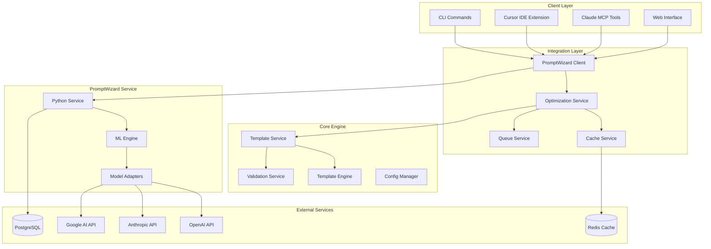

# PromptWizard Integration Architecture

This document explains the architectural design principles, integration patterns, and technical decisions that enable seamless integration of Microsoft PromptWizard with the Cursor Prompt Template Engine.

## System Overview

The PromptWizard integration follows a microservices architecture with clear separation of concerns, enabling scalable, maintainable, and reliable prompt optimization capabilities.

### High-Level Architecture



## Design Principles

### 1. Loose Coupling

The integration maintains loose coupling between the template engine and PromptWizard service through well-defined interfaces and async communication patterns.

#### Interface Segregation

```typescript
// Separate interfaces for different concerns
interface OptimizationClient {
  optimizePrompt(request: OptimizationRequest): Promise<OptimizationResult>;
  healthCheck(): Promise<boolean>;
}

interface QualityAssessment {
  scorePrompt(prompt: string): Promise<QualityScore>;
  comparePrompts(a: string, b: string): Promise<ComparisonResult>;
}

interface ExampleGeneration {
  generateExamples(task: string, count: number): Promise<Example[]>;
}

// Main client implements all interfaces
class PromptWizardClient implements OptimizationClient, QualityAssessment, ExampleGeneration {
  // Implementation details
}
```

#### Dependency Injection

```typescript
// Service composition through dependency injection
class PromptOptimizationService {
  constructor(
    private client: OptimizationClient,
    private templateService: TemplateService,
    private cacheService: CacheService,
    private logger: Logger
  ) {}
  
  async optimizeTemplate(request: OptimizationRequest): Promise<OptimizationResult> {
    // Use injected dependencies
    const template = await this.templateService.loadTemplate(request.templateId);
    const cached = await this.cacheService.get(this.generateCacheKey(request));
    
    if (cached) {
      this.logger.info('Optimization cache hit');
      return cached;
    }
    
    return this.client.optimizePrompt(request);
  }
}
```

### 2. Resilience and Fault Tolerance

The system implements comprehensive error handling, circuit breakers, and fallback mechanisms.

#### Circuit Breaker Pattern

```typescript
class CircuitBreaker {
  private failures = 0;
  private lastFailureTime = 0;
  private state: 'CLOSED' | 'OPEN' | 'HALF_OPEN' = 'CLOSED';
  
  constructor(
    private threshold: number = 5,
    private timeout: number = 60000
  ) {}
  
  async execute<T>(operation: () => Promise<T>): Promise<T> {
    if (this.state === 'OPEN') {
      if (Date.now() - this.lastFailureTime < this.timeout) {
        throw new Error('Circuit breaker is OPEN');
      }
      this.state = 'HALF_OPEN';
    }
    
    try {
      const result = await operation();
      this.onSuccess();
      return result;
    } catch (error) {
      this.onFailure();
      throw error;
    }
  }
  
  private onSuccess() {
    this.failures = 0;
    this.state = 'CLOSED';
  }
  
  private onFailure() {
    this.failures++;
    this.lastFailureTime = Date.now();
    
    if (this.failures >= this.threshold) {
      this.state = 'OPEN';
    }
  }
}
```

#### Retry Logic with Exponential Backoff

```typescript
class RetryPolicy {
  constructor(
    private maxRetries: number = 3,
    private baseDelay: number = 1000,
    private maxDelay: number = 30000
  ) {}
  
  async execute<T>(operation: () => Promise<T>): Promise<T> {
    let lastError: Error;
    
    for (let attempt = 0; attempt <= this.maxRetries; attempt++) {
      try {
        return await operation();
      } catch (error) {
        lastError = error as Error;
        
        if (attempt === this.maxRetries || !this.isRetryable(error)) {
          throw error;
        }
        
        const delay = Math.min(
          this.baseDelay * Math.pow(2, attempt),
          this.maxDelay
        );
        
        await this.delay(delay);
      }
    }
    
    throw lastError!;
  }
  
  private isRetryable(error: Error): boolean {
    // Retry on network errors, timeouts, and 5xx responses
    return error.message.includes('timeout') ||
           error.message.includes('ECONNRESET') ||
           error.message.includes('502') ||
           error.message.includes('503') ||
           error.message.includes('504');
  }
  
  private delay(ms: number): Promise<void> {
    return new Promise(resolve => setTimeout(resolve, ms));
  }
}
```

### 3. Observability and Monitoring

Comprehensive logging, metrics, and tracing enable effective monitoring and debugging.

#### Structured Logging

```typescript
class OptimizationLogger {
  private logger: Logger;
  
  constructor() {
    this.logger = createLogger({
      format: winston.format.combine(
        winston.format.timestamp(),
        winston.format.json()
      ),
      transports: [
        new winston.transports.Console(),
        new winston.transports.File({ filename: 'optimization.log' })
      ]
    });
  }
  
  logOptimizationStart(request: OptimizationRequest) {
    this.logger.info('Optimization started', {
      templateId: request.templateId,
      model: request.config.targetModel,
      iterations: request.config.mutateRefineIterations,
      timestamp: new Date().toISOString(),
      requestId: request.metadata?.requestId
    });
  }
  
  logOptimizationComplete(result: OptimizationResult) {
    this.logger.info('Optimization completed', {
      templateId: result.templateId,
      tokenReduction: result.metrics.tokenReduction,
      qualityScore: result.qualityScore.overall,
      duration: result.metrics.optimizationTime,
      requestId: result.requestId
    });
  }
  
  logOptimizationError(error: Error, context: any) {
    this.logger.error('Optimization failed', {
      error: error.message,
      stack: error.stack,
      context,
      timestamp: new Date().toISOString()
    });
  }
}
```

#### Metrics Collection

```typescript
class MetricsCollector {
  private registry: Registry;
  
  constructor() {
    this.registry = new Registry();
    
    this.optimizationCounter = new Counter({
      name: 'promptwizard_optimizations_total',
      help: 'Total number of optimizations',
      labelNames: ['model', 'status'],
      registers: [this.registry]
    });
    
    this.optimizationDuration = new Histogram({
      name: 'promptwizard_optimization_duration_seconds',
      help: 'Optimization duration in seconds',
      labelNames: ['model'],
      buckets: [1, 5, 10, 30, 60, 120, 300],
      registers: [this.registry]
    });
    
    this.qualityScoreGauge = new Gauge({
      name: 'promptwizard_quality_score',
      help: 'Current quality score',
      labelNames: ['templateId', 'model'],
      registers: [this.registry]
    });
  }
  
  recordOptimization(result: OptimizationResult) {
    const model = result.optimizedTemplate.metadata.targetModel;
    
    this.optimizationCounter.inc({ model, status: 'success' });
    this.optimizationDuration.observe({ model }, result.metrics.optimizationTime / 1000);
    this.qualityScoreGauge.set(
      { templateId: result.templateId, model },
      result.qualityScore.overall
    );
  }
  
  recordError(templateId: string, model: string, error: Error) {
    this.optimizationCounter.inc({ model, status: 'error' });
  }
}
```

## Integration Patterns

### 1. Service Bridge Pattern

The integration uses a service bridge to translate between the TypeScript template engine and Python PromptWizard service.

#### Request Translation

```typescript
class PromptWizardBridge {
  async translateRequest(
    templateRequest: OptimizationRequest
  ): Promise<PythonServiceRequest> {
    return {
      prompt: templateRequest.template.content,
      task: templateRequest.config.task,
      model: this.mapModelName(templateRequest.config.targetModel),
      config: {
        mutate_refine_iterations: templateRequest.config.mutateRefineIterations,
        few_shot_count: templateRequest.config.fewShotCount,
        generate_reasoning: templateRequest.config.generateReasoning,
        hyperparameters: this.translateHyperparameters(
          templateRequest.config.hyperparameters
        )
      },
      options: {
        skip_cache: templateRequest.options?.skipCache || false,
        priority: this.mapPriority(templateRequest.options?.priority),
        timeout: templateRequest.options?.timeout || 120
      }
    };
  }
  
  async translateResponse(
    pythonResponse: PythonServiceResponse
  ): Promise<OptimizationResult> {
    return {
      templateId: pythonResponse.template_id,
      requestId: pythonResponse.request_id,
      timestamp: pythonResponse.timestamp,
      metrics: {
        tokenReduction: pythonResponse.metrics.token_reduction,
        accuracyImprovement: pythonResponse.metrics.accuracy_improvement,
        optimizationTime: pythonResponse.metrics.optimization_time,
        apiCalls: pythonResponse.metrics.api_calls,
        costReduction: pythonResponse.metrics.cost_reduction,
        qualityImprovement: pythonResponse.metrics.quality_improvement
      },
      qualityScore: this.translateQualityScore(pythonResponse.quality_score),
      optimizedTemplate: this.translateOptimizedTemplate(
        pythonResponse.optimized_template
      ),
      optimization: this.translateOptimizationDetails(
        pythonResponse.optimization
      )
    };
  }
}
```

### 2. Event-Driven Architecture

The system uses events to enable loose coupling and extensibility.

#### Event System

```typescript
interface OptimizationEvents {
  'optimization:started': (request: OptimizationRequest) => void;
  'optimization:progress': (progress: OptimizationProgress) => void;
  'optimization:completed': (result: OptimizationResult) => void;
  'optimization:failed': (error: OptimizationError) => void;
  'batch:started': (request: BatchOptimizationRequest) => void;
  'batch:progress': (progress: BatchProgress) => void;
  'batch:completed': (result: BatchOptimizationResult) => void;
  'cache:hit': (key: string) => void;
  'cache:miss': (key: string) => void;
}

class OptimizationEventBus extends TypedEventEmitter<OptimizationEvents> {
  // Event emission and subscription logic
}

// Usage in services
class PromptOptimizationService {
  constructor(private eventBus: OptimizationEventBus) {
    this.setupEventListeners();
  }
  
  private setupEventListeners() {
    this.eventBus.on('optimization:completed', (result) => {
      // Update cache, metrics, etc.
      this.cacheService.set(this.generateCacheKey(result), result);
      this.metricsCollector.recordOptimization(result);
    });
    
    this.eventBus.on('optimization:failed', (error) => {
      // Handle errors, update metrics
      this.metricsCollector.recordError(error.templateId, error.model, error.error);
      this.logger.logOptimizationError(error.error, error);
    });
  }
  
  async optimizeTemplate(request: OptimizationRequest): Promise<OptimizationResult> {
    this.eventBus.emit('optimization:started', request);
    
    try {
      const result = await this.performOptimization(request);
      this.eventBus.emit('optimization:completed', result);
      return result;
    } catch (error) {
      this.eventBus.emit('optimization:failed', {
        templateId: request.templateId,
        model: request.config.targetModel,
        error: error as Error,
        request
      });
      throw error;
    }
  }
}
```

### 3. Plugin Architecture

The integration supports plugins for extensibility and customization.

#### Plugin Interface

```typescript
interface OptimizationPlugin {
  name: string;
  version: string;
  
  // Lifecycle hooks
  beforeOptimization?(request: OptimizationRequest): Promise<OptimizationRequest>;
  afterOptimization?(result: OptimizationResult): Promise<OptimizationResult>;
  
  // Custom optimization strategies
  customOptimizationStrategy?(request: OptimizationRequest): Promise<OptimizationResult>;
  
  // Quality assessment extensions
  customQualityMetrics?(prompt: string): Promise<Record<string, number>>;
}

class PluginManager {
  private plugins: Map<string, OptimizationPlugin> = new Map();
  
  registerPlugin(plugin: OptimizationPlugin) {
    this.plugins.set(plugin.name, plugin);
  }
  
  async executeHook<T>(
    hookName: keyof OptimizationPlugin,
    data: T
  ): Promise<T> {
    let result = data;
    
    for (const plugin of this.plugins.values()) {
      const hook = plugin[hookName];
      if (typeof hook === 'function') {
        result = await hook(result);
      }
    }
    
    return result;
  }
  
  getPlugin(name: string): OptimizationPlugin | undefined {
    return this.plugins.get(name);
  }
}

// Usage in optimization service
class PromptOptimizationService {
  constructor(
    private pluginManager: PluginManager,
    // ... other dependencies
  ) {}
  
  async optimizeTemplate(request: OptimizationRequest): Promise<OptimizationResult> {
    // Execute pre-optimization hooks
    const modifiedRequest = await this.pluginManager.executeHook(
      'beforeOptimization',
      request
    );
    
    // Perform optimization
    let result = await this.performOptimization(modifiedRequest);
    
    // Execute post-optimization hooks
    result = await this.pluginManager.executeHook('afterOptimization', result);
    
    return result;
  }
}
```

## Performance Architecture

### 1. Caching Strategy

Multi-layered caching improves performance and reduces costs.

#### Cache Architecture

```typescript
interface CacheLayer {
  get(key: string): Promise<any>;
  set(key: string, value: any, ttl?: number): Promise<void>;
  invalidate(pattern: string): Promise<void>;
}

class MemoryCache implements CacheLayer {
  private cache = new LRUCache<string, any>(1000);
  
  async get(key: string): Promise<any> {
    return this.cache.get(key);
  }
  
  async set(key: string, value: any, ttl = 3600): Promise<void> {
    this.cache.set(key, value, ttl * 1000);
  }
  
  async invalidate(pattern: string): Promise<void> {
    const regex = new RegExp(pattern.replace('*', '.*'));
    
    for (const key of this.cache.keys()) {
      if (regex.test(key)) {
        this.cache.delete(key);
      }
    }
  }
}

class RedisCache implements CacheLayer {
  constructor(private client: Redis) {}
  
  async get(key: string): Promise<any> {
    const value = await this.client.get(key);
    return value ? JSON.parse(value) : null;
  }
  
  async set(key: string, value: any, ttl = 3600): Promise<void> {
    await this.client.setex(key, ttl, JSON.stringify(value));
  }
  
  async invalidate(pattern: string): Promise<void> {
    const keys = await this.client.keys(pattern);
    if (keys.length > 0) {
      await this.client.del(...keys);
    }
  }
}

class HierarchicalCache {
  constructor(
    private l1Cache: MemoryCache,
    private l2Cache: RedisCache
  ) {}
  
  async get(key: string): Promise<any> {
    // Try L1 cache first
    let value = await this.l1Cache.get(key);
    if (value) return value;
    
    // Try L2 cache
    value = await this.l2Cache.get(key);
    if (value) {
      // Populate L1 cache
      await this.l1Cache.set(key, value);
      return value;
    }
    
    return null;
  }
  
  async set(key: string, value: any, ttl = 3600): Promise<void> {
    await Promise.all([
      this.l1Cache.set(key, value, ttl),
      this.l2Cache.set(key, value, ttl)
    ]);
  }
}
```

### 2. Queue Architecture

Asynchronous processing through queues handles batch operations and load balancing.

#### Queue System

```typescript
interface QueueJob<T = any> {
  id: string;
  type: string;
  data: T;
  priority: number;
  retries: number;
  maxRetries: number;
  createdAt: Date;
  processedAt?: Date;
}

class OptimizationQueue {
  private queue: Queue;
  
  constructor() {
    this.queue = new Bull('optimization', {
      redis: { host: 'localhost', port: 6379 },
      defaultJobOptions: {
        removeOnComplete: 100,
        removeOnFail: 50,
        attempts: 3,
        backoff: 'exponential'
      }
    });
    
    this.setupProcessors();
  }
  
  private setupProcessors() {
    this.queue.process('single-optimization', 5, this.processSingleOptimization.bind(this));
    this.queue.process('batch-optimization', 2, this.processBatchOptimization.bind(this));
  }
  
  async queueOptimization(request: OptimizationRequest): Promise<string> {
    const job = await this.queue.add('single-optimization', request, {
      priority: this.mapPriority(request.options?.priority),
      delay: request.options?.delay || 0
    });
    
    return job.id.toString();
  }
  
  async queueBatchOptimization(request: BatchOptimizationRequest): Promise<string> {
    const job = await this.queue.add('batch-optimization', request, {
      priority: this.mapPriority(request.options?.priority)
    });
    
    return job.id.toString();
  }
  
  private async processSingleOptimization(job: Job<OptimizationRequest>) {
    const { data: request } = job;
    
    // Update job progress
    await job.progress(10);
    
    try {
      const result = await this.optimizationService.optimizeTemplate(request);
      await job.progress(100);
      return result;
    } catch (error) {
      await job.progress(0);
      throw error;
    }
  }
  
  private mapPriority(priority: Priority = 'normal'): number {
    const priorityMap = {
      low: 1,
      normal: 5,
      high: 10,
      critical: 20
    };
    
    return priorityMap[priority];
  }
}
```

## Security Architecture

### 1. Authentication and Authorization

Secure API access through JWT tokens and role-based access control.

#### Authentication System

```typescript
interface UserClaims {
  sub: string; // User ID
  name: string;
  email: string;
  roles: string[];
  permissions: string[];
  exp: number;
}

class AuthenticationService {
  constructor(
    private jwtSecret: string,
    private tokenExpiry: string = '24h'
  ) {}
  
  async authenticateUser(credentials: LoginCredentials): Promise<AuthToken> {
    const user = await this.validateCredentials(credentials);
    
    if (!user) {
      throw new UnauthorizedError('Invalid credentials');
    }
    
    const claims: UserClaims = {
      sub: user.id,
      name: user.name,
      email: user.email,
      roles: user.roles,
      permissions: this.getUserPermissions(user.roles),
      exp: Math.floor(Date.now() / 1000) + (24 * 60 * 60) // 24 hours
    };
    
    const token = jwt.sign(claims, this.jwtSecret);
    
    return {
      token,
      expiresAt: new Date(claims.exp * 1000),
      user: {
        id: user.id,
        name: user.name,
        email: user.email
      }
    };
  }
  
  async validateToken(token: string): Promise<UserClaims> {
    try {
      const claims = jwt.verify(token, this.jwtSecret) as UserClaims;
      return claims;
    } catch (error) {
      throw new UnauthorizedError('Invalid token');
    }
  }
  
  hasPermission(claims: UserClaims, permission: string): boolean {
    return claims.permissions.includes(permission) ||
           claims.permissions.includes('admin:all');
  }
}

// Authorization middleware
class AuthorizationMiddleware {
  constructor(private authService: AuthenticationService) {}
  
  requirePermission(permission: string) {
    return async (req: Request, res: Response, next: NextFunction) => {
      const token = this.extractToken(req);
      
      if (!token) {
        return res.status(401).json({ error: 'No token provided' });
      }
      
      try {
        const claims = await this.authService.validateToken(token);
        
        if (!this.authService.hasPermission(claims, permission)) {
          return res.status(403).json({ error: 'Insufficient permissions' });
        }
        
        req.user = claims;
        next();
      } catch (error) {
        return res.status(401).json({ error: 'Invalid token' });
      }
    };
  }
  
  private extractToken(req: Request): string | null {
    const authHeader = req.headers.authorization;
    return authHeader?.startsWith('Bearer ') ? authHeader.slice(7) : null;
  }
}
```

### 2. Data Protection

Encryption at rest and in transit, plus secure handling of sensitive data.

#### Data Encryption

```typescript
class EncryptionService {
  constructor(private encryptionKey: string) {}
  
  encrypt(data: string): string {
    const iv = crypto.randomBytes(16);
    const cipher = crypto.createCipher('aes-256-cbc', this.encryptionKey);
    cipher.setAutoPadding(true);
    
    let encrypted = cipher.update(data, 'utf8', 'base64');
    encrypted += cipher.final('base64');
    
    return `${iv.toString('base64')}:${encrypted}`;
  }
  
  decrypt(encryptedData: string): string {
    const [ivString, encrypted] = encryptedData.split(':');
    const iv = Buffer.from(ivString, 'base64');
    
    const decipher = crypto.createDecipheriv('aes-256-cbc', this.encryptionKey, iv);
    decipher.setAutoPadding(true);
    
    let decrypted = decipher.update(encrypted, 'base64', 'utf8');
    decrypted += decipher.final('utf8');
    
    return decrypted;
  }
}

// Secure template storage
class SecureTemplateService {
  constructor(
    private templateService: TemplateService,
    private encryptionService: EncryptionService
  ) {}
  
  async saveTemplate(template: Template): Promise<void> {
    const sensitiveFields = ['apiKeys', 'secrets', 'personalData'];
    
    for (const field of sensitiveFields) {
      if (template[field]) {
        template[field] = this.encryptionService.encrypt(
          JSON.stringify(template[field])
        );
      }
    }
    
    await this.templateService.saveTemplate(template);
  }
  
  async loadTemplate(templateId: string): Promise<Template> {
    const template = await this.templateService.loadTemplate(templateId);
    
    const sensitiveFields = ['apiKeys', 'secrets', 'personalData'];
    
    for (const field of sensitiveFields) {
      if (template[field]) {
        template[field] = JSON.parse(
          this.encryptionService.decrypt(template[field])
        );
      }
    }
    
    return template;
  }
}
```

## Scalability Considerations

### 1. Horizontal Scaling

The architecture supports horizontal scaling through stateless services and distributed caching.

#### Load Balancing

```typescript
class LoadBalancer {
  private servers: ServerNode[] = [];
  private currentIndex = 0;
  
  addServer(server: ServerNode) {
    this.servers.push(server);
  }
  
  removeServer(serverId: string) {
    this.servers = this.servers.filter(s => s.id !== serverId);
  }
  
  getNextServer(): ServerNode {
    if (this.servers.length === 0) {
      throw new Error('No servers available');
    }
    
    // Round-robin selection
    const server = this.servers[this.currentIndex];
    this.currentIndex = (this.currentIndex + 1) % this.servers.length;
    
    return server;
  }
  
  async healthCheck() {
    const healthPromises = this.servers.map(async server => {
      try {
        await server.healthCheck();
        server.healthy = true;
      } catch (error) {
        server.healthy = false;
      }
    });
    
    await Promise.all(healthPromises);
    
    // Remove unhealthy servers from rotation
    this.servers = this.servers.filter(s => s.healthy);
  }
}
```

### 2. Auto-scaling

Dynamic scaling based on queue depth and system metrics.

#### Auto-scaling Controller

```typescript
class AutoScalingController {
  constructor(
    private queueService: OptimizationQueue,
    private containerOrchestrator: ContainerOrchestrator
  ) {}
  
  async evaluateScaling() {
    const metrics = await this.collectMetrics();
    const scalingDecision = this.calculateScalingDecision(metrics);
    
    if (scalingDecision.action === 'scale_up') {
      await this.scaleUp(scalingDecision.count);
    } else if (scalingDecision.action === 'scale_down') {
      await this.scaleDown(scalingDecision.count);
    }
  }
  
  private async collectMetrics() {
    const [queueDepth, cpuUsage, memoryUsage, activeConnections] = await Promise.all([
      this.queueService.getQueueDepth(),
      this.getCpuUsage(),
      this.getMemoryUsage(),
      this.getActiveConnections()
    ]);
    
    return {
      queueDepth,
      cpuUsage,
      memoryUsage,
      activeConnections
    };
  }
  
  private calculateScalingDecision(metrics: SystemMetrics): ScalingDecision {
    if (metrics.queueDepth > 50 || metrics.cpuUsage > 80) {
      return { action: 'scale_up', count: 2 };
    }
    
    if (metrics.queueDepth < 10 && metrics.cpuUsage < 30) {
      return { action: 'scale_down', count: 1 };
    }
    
    return { action: 'maintain', count: 0 };
  }
}
```

## Future Architecture Evolution

### 1. Microservices Decomposition

Further decomposition into specialized microservices for better scalability and maintainability.

### 2. Event Sourcing

Implementation of event sourcing for better auditability and state reconstruction.

### 3. CQRS Pattern

Separation of command and query responsibilities for optimized read/write operations.

### 4. Multi-tenant Architecture

Support for multiple organizations with data isolation and resource management.

## Conclusion

The PromptWizard integration architecture provides a robust, scalable, and maintainable foundation for advanced prompt optimization. Through careful application of design patterns, comprehensive error handling, and thoughtful performance optimization, the system delivers enterprise-grade reliability while maintaining flexibility for future enhancements.

The modular design enables incremental adoption, easy testing, and seamless integration with existing workflows, making it an ideal solution for organizations looking to leverage AI-powered prompt optimization at scale.