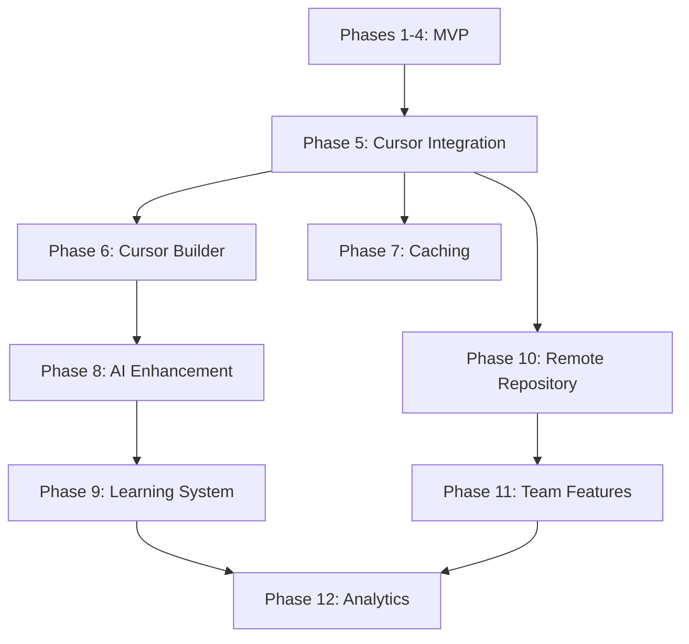

# Extended Feature Planning: Cursor Prompt Template Engine
## Full Product Roadmap Including Advanced Features

## Executive Summary
This extended planning document outlines the complete product evolution from MVP to enterprise-ready prompt management system. While the initial release focuses on core template functionality, this roadmap shows the path to a comprehensive prompt optimization platform designed specifically for Cursor IDE.

## Product Evolution Stages

### Stage 1: MVP (Phases 1-4) - Weeks 1-4
Core template engine with basic functionality

### Stage 2: Enhanced (Phases 5-7) - Months 2-3  
Cursor integration and intelligent features

### Stage 3: Advanced (Phases 8-10) - Months 4-6
Collaboration and optimization features

### Stage 4: Enterprise (Phases 11-12) - Months 7-9
Team features and analytics

---

## MVP Implementation (Phases 1-4)
*[Previous planning content - Weeks 1-4]*

---

## Extended Implementation Phases

### Phase 5: Cursor-Native Integration

#### Task 9: Research Cursor Integration Architecture
**Type:** research  
**Complexity:** Medium  
**Duration:** 2 sessions  

**Todo List:**
- [ ] Research Cursor-specific integration points
  - WebSearch: "Cursor IDE API documentation 2025"
  - WebSearch: "Cursor rules and context management"
  - WebSearch: "Cursor AI features integration patterns"
- [ ] Analyze Cursor's unique capabilities
  - Study .cursorrules system
  - Research Cursor's context awareness
  - Explore Cursor's AI conversation API
- [ ] Design Cursor-native architecture
  - .cursor folder integration
  - Cursor chat integration
  - Context window optimization
  - Prompt history integration
- [ ] Plan CLI-to-Cursor bridge
- [ ] Document Cursor-specific optimizations

#### Task 10: Implement Cursor Integration Layer
**Type:** implementation  
**Depends:** Task 9  
**Complexity:** High  

**Todo List:**
- [ ] Set up Cursor integration environment
  - Configure .cursor folder structure
  - Create cursor-specific configs
  - Set up prompt injection points
- [ ] Implement Cursor command integration
  - Create custom Cursor commands
  - Add to command palette
  - Configure keyboard shortcuts
- [ ] Build Cursor-aware template system
  - Auto-detect Cursor context
  - Use Cursor's file awareness
  - Leverage Cursor's symbol indexing
- [ ] Integrate with Cursor's AI features
  - Hook into Cursor chat
  - Use Cursor's context gathering
  - Optimize for Claude in Cursor
- [ ] Add .cursorrules enhancement
  - Dynamic rule generation
  - Context-aware rules
  - Template-based rules
- [ ] Implement Cursor settings integration
  - Add to Cursor preferences
  - Sync with .cursor folder
  - Respect Cursor's context limits
- [ ] Write Cursor integration tests

#### Task 11: Cursor Context Optimization
**Type:** implementation  
**Depends:** Task 10  
**Complexity:** Medium  

**Todo List:**
- [ ] Implement Cursor-specific context detection
  - Use Cursor's active context
  - Detect Cursor's selected files
  - Extract Cursor's error context
- [ ] Add Cursor workspace analysis
  - Leverage Cursor's project understanding
  - Use Cursor's dependency graph
  - Identify Cursor-indexed symbols
- [ ] Integrate with Cursor's AI diagnostics
  - Use Cursor's AI suggestions
  - Include Cursor's problem detection
  - Add Cursor fix suggestions
- [ ] Build Cursor-aware template suggestion
  - Analyze Cursor conversation history
  - Suggest based on Cursor context
  - Learn from Cursor usage patterns
- [ ] Add Cursor inline generation
  - Generate via Cursor comments
  - Support Cursor's @ mentions
  - Use Cursor's inline AI
- [ ] Test Cursor context accuracy

### Phase 6: Cursor-Optimized Prompt Builder

#### Task 12: Design Cursor-Native Builder System
**Type:** design  
**Depends:** Task 11  
**Complexity:** High  

**Todo List:**
- [ ] Research Cursor UI patterns
  - WebSearch: "Cursor IDE UI customization 2025"
  - WebSearch: "Cursor chat interface integration"
  - WebSearch: "Cursor composer mode automation"
- [ ] Design Cursor-integrated wizard flow
  - Step 1: Template selection via Cursor
  - Step 2: Cursor context gathering
  - Step 3: Variable input in Cursor
  - Step 4: Preview in Cursor chat
  - Step 5: Direct Cursor execution
- [ ] Create Cursor UI integration points
  - Cursor sidebar integration
  - Cursor chat enhancements
  - Cursor composer templates
- [ ] Plan Cursor state management
  - Cursor history integration
  - Cursor context preservation
  - Cursor session management
- [ ] Document Cursor interaction patterns

#### Task 13: Implement Cursor Builder Interface
**Type:** implementation  
**Depends:** Task 12  
**Complexity:** High  

**Todo List:**
- [ ] Set up Cursor UI hooks
  - Configure Cursor panels
  - Set up Cursor messaging
  - Implement Cursor security
- [ ] Build Cursor form components
  - Cursor-native inputs
  - Cursor file selectors
  - Cursor context pickers
  - Cursor AI suggestions
  - Cursor preview panes
- [ ] Implement Cursor navigation
  - Cursor command flow
  - Cursor shortcut system
  - Cursor validation
  - Cursor state saving
- [ ] Add Cursor dynamic generation
  - Parse via Cursor AI
  - Generate with Cursor
  - Handle Cursor conditions
- [ ] Create Cursor live preview
  - Real-time in Cursor chat
  - Cursor syntax highlighting
  - Cursor diff viewing
- [ ] Test Cursor interactions

#### Task 14: Advanced Cursor Builder Features
**Type:** implementation  
**Depends:** Task 13  
**Complexity:** Medium  

**Todo List:**
- [ ] Implement Cursor template chaining
  - Chain in Cursor composer
  - Order via Cursor workflow
  - Merge in Cursor context
- [ ] Add Cursor variable intelligence
  - Cursor AI field suggestions
  - Cursor-calculated fields
  - Cursor validation rules
- [ ] Build Cursor snippet library
  - Cursor code snippets
  - Cursor search integration
  - Cursor snippet creation
- [ ] Add Cursor history integration
  - Use Cursor chat history
  - Cursor favorites system
  - Cursor quick access
- [ ] Implement Cursor navigation
  - Cursor command palette
  - Cursor shortcuts
  - Cursor accessibility
- [ ] Cursor performance optimization

### Phase 7: Intelligent Caching System

#### Task 15: Design Caching Architecture
**Type:** architecture  
**Depends:** Task 6  
**Complexity:** Medium  

**Todo List:**
- [ ] Research caching strategies
  - WebSearch: "TypeScript caching strategies 2025"
  - WebSearch: "LRU vs LFU cache comparison"
  - WebSearch: "file system cache best practices Node.js"
- [ ] Design cache hierarchy
  - Memory cache (hot)
  - Disk cache (warm)
  - Invalidation strategies
- [ ] Plan cache key generation
  - Template version tracking
  - Context fingerprinting
  - Variable hashing
- [ ] Design cache configuration
  - Size limits
  - TTL settings
  - Purge strategies
- [ ] Document performance targets

#### Task 16: Implement Multi-Level Cache
**Type:** implementation  
**Depends:** Task 15  
**Complexity:** Medium  

**Todo List:**
- [ ] Build memory cache layer
  - LRU cache implementation
  - Size-based eviction
  - TTL support
- [ ] Implement disk cache
  - File-based storage
  - Compression support
  - Atomic writes
- [ ] Add cache warming
  - Preload frequent templates
  - Background cache refresh
  - Predictive loading
- [ ] Create cache statistics
  - Hit/miss ratios
  - Performance metrics
  - Size monitoring
- [ ] Implement cache invalidation
  - Template change detection
  - Manual cache clear
  - Selective invalidation
- [ ] Write cache tests

### Phase 8: AI-Powered Prompt Optimization

#### Task 17: Research AI Enhancement Approaches
**Type:** research  
**Complexity:** High  
**Duration:** 3 sessions  

**Todo List:**
- [ ] Research prompt optimization techniques
  - WebSearch: "LLM prompt optimization techniques 2025"
  - WebSearch: "prompt engineering automation tools"
  - WebSearch: "few-shot learning prompt improvement"
- [ ] Investigate integration options
  - Local LLM models (Ollama, llama.cpp)
  - API services (OpenAI, Anthropic)
  - Hybrid approaches
- [ ] Analyze optimization strategies
  - Prompt scoring algorithms
  - A/B testing frameworks
  - Success metric definition
- [ ] Research privacy considerations
  - Data handling policies
  - User consent requirements
  - Opt-out mechanisms
- [ ] Evaluate performance impact
- [ ] Document findings and recommendations

#### Task 18: Implement Prompt Scoring System
**Type:** implementation  
**Depends:** Task 17  
**Complexity:** High  

**Todo List:**
- [ ] Build prompt analysis engine
  - Tokenization and parsing
  - Complexity scoring
  - Clarity assessment
  - Completeness checking
- [ ] Implement scoring algorithms
  - Readability scores
  - Specificity metrics
  - Context coverage
  - Ambiguity detection
- [ ] Create feedback system
  - Score visualization
  - Improvement suggestions
  - Before/after comparison
- [ ] Add benchmark comparisons
  - Compare against best practices
  - Industry standard templates
  - Success rate tracking
- [ ] Build A/B testing framework
  - Variant generation
  - Result tracking
  - Statistical analysis
- [ ] Test scoring accuracy

#### Task 19: AI-Powered Enhancement Engine
**Type:** implementation  
**Depends:** Task 18  
**Complexity:** Very High  

**Todo List:**
- [ ] Integrate LLM service
  - API client implementation
  - Rate limiting
  - Error handling
  - Fallback strategies
- [ ] Build prompt enhancement pipeline
  - Analyze original prompt
  - Generate improvements
  - Validate enhancements
  - Merge changes
- [ ] Implement learning system
  - Track enhancement success
  - Update improvement patterns
  - Personalization engine
- [ ] Add safety checks
  - Prevent prompt injection
  - Content filtering
  - Size limitations
  - Cost controls
- [ ] Create opt-in UI
  - Enhancement toggles
  - Privacy settings
  - Enhancement preview
- [ ] Performance optimization
- [ ] Comprehensive testing

### Phase 9: Template Learning and Adaptation

#### Task 20: Design Learning System Architecture
**Type:** architecture  
**Depends:** Task 19  
**Complexity:** High  

**Todo List:**
- [ ] Research ML approaches for templates
  - WebSearch: "template learning systems 2025"
  - WebSearch: "usage pattern analysis ML"
  - WebSearch: "personalization without privacy violation"
- [ ] Design data collection pipeline
  - Usage metrics to track
  - Storage architecture
  - Privacy-preserving techniques
- [ ] Plan adaptation algorithms
  - Template evolution strategies
  - Parameter tuning methods
  - Success measurement
- [ ] Design feedback loop
  - Implicit feedback (usage)
  - Explicit feedback (ratings)
  - Correction mechanisms
- [ ] Document learning boundaries

#### Task 21: Implement Usage Analytics
**Type:** implementation  
**Depends:** Task 20  
**Complexity:** Medium  

**Todo List:**
- [ ] Build telemetry system
  - Event tracking
  - Anonymous usage metrics
  - Opt-in configuration
- [ ] Create analytics database
  - Local SQLite storage
  - Data retention policies
  - Backup strategies
- [ ] Implement pattern detection
  - Frequent variable combinations
  - Common context patterns
  - Template sequences
- [ ] Build reporting dashboard
  - Usage statistics
  - Popular templates
  - Success metrics
- [ ] Add privacy controls
  - Data anonymization
  - Export user data
  - Complete deletion
- [ ] Test data collection

#### Task 22: Template Evolution Engine
**Type:** implementation  
**Depends:** Task 21  
**Complexity:** Very High  

**Todo List:**
- [ ] Build template mutation system
  - Variable addition/removal
  - Section reordering
  - Content refinement
- [ ] Implement success tracking
  - Prompt acceptance rate
  - Task completion metrics
  - Error reduction tracking
- [ ] Create personalization engine
  - User-specific adaptations
  - Role-based templates
  - Project-type optimization
- [ ] Add template versioning
  - Evolution history
  - Rollback capability
  - A/B testing variants
- [ ] Build recommendation system
  - Suggest template improvements
  - Propose new templates
  - Context-aware suggestions
- [ ] Extensive testing and validation

### Phase 10: Remote Repository Integration

#### Task 23: Design Repository Architecture
**Type:** architecture  
**Complexity:** High  

**Todo List:**
- [ ] Research template sharing platforms
  - WebSearch: "code template sharing platforms 2025"
  - WebSearch: "GitHub gist alternatives for templates"
  - WebSearch: "npm registry for non-code assets"
- [ ] Design repository structure
  - Template metadata format
  - Versioning strategy
  - Dependency management
- [ ] Plan authentication system
  - OAuth integration
  - API key management
  - Anonymous access
- [ ] Design search and discovery
  - Template categorization
  - Tagging system
  - Quality scoring
- [ ] Document security model

#### Task 24: Implement GitHub Integration
**Type:** implementation  
**Depends:** Task 23  
**Complexity:** High  

**Todo List:**
- [ ] Build GitHub client
  - OAuth authentication
  - Gist API integration
  - Repository access
- [ ] Implement template publishing
  - Package templates
  - Upload to gists/repos
  - Version tagging
- [ ] Create template discovery
  - Search GitHub for templates
  - Filter by stars/quality
  - Preview before download
- [ ] Add template installation
  - Download from GitHub
  - Dependency resolution
  - Local installation
- [ ] Build update system
  - Check for updates
  - Auto-update option
  - Changelog display
- [ ] Security scanning
- [ ] Integration testing

#### Task 25: Template Marketplace
**Type:** implementation  
**Depends:** Task 24  
**Complexity:** Very High  

**Todo List:**
- [ ] Build marketplace backend
  - API server setup
  - Database design
  - Authentication system
- [ ] Create web marketplace
  - Template browsing
  - Search and filters
  - User ratings/reviews
- [ ] Implement quality control
  - Template validation
  - Security scanning
  - Community moderation
- [ ] Add monetization (optional)
  - Premium templates
  - Donation system
  - Subscription tiers
- [ ] Build CLI marketplace commands
  - Search marketplace
  - Install templates
  - Publish templates
- [ ] Create documentation site
- [ ] Launch and monitoring

### Phase 11: Team Collaboration Features

#### Task 26: Design Team Architecture
**Type:** architecture  
**Depends:** Task 25  
**Complexity:** High  

**Todo List:**
- [ ] Research team collaboration patterns
  - WebSearch: "team development tool collaboration 2025"
  - WebSearch: "shared configuration management"
  - WebSearch: "real-time collaboration protocols"
- [ ] Design team structure
  - Organization model
  - Permission system
  - Role definitions
- [ ] Plan synchronization strategy
  - Conflict resolution
  - Merge strategies
  - Offline support
- [ ] Design sharing mechanisms
  - Template sharing
  - Configuration sync
  - Usage analytics
- [ ] Document scaling considerations

#### Task 27: Implement Team Workspace
**Type:** implementation  
**Depends:** Task 26  
**Complexity:** Very High  

**Todo List:**
- [ ] Build team backend service
  - User authentication
  - Team management
  - Permission system
- [ ] Implement template sharing
  - Team template library
  - Access controls
  - Version management
- [ ] Create configuration sync
  - Shared settings
  - Override hierarchy
  - Conflict resolution
- [ ] Add real-time collaboration
  - WebSocket server
  - Presence indicators
  - Live template editing
- [ ] Build team dashboard
  - Usage analytics
  - Member management
  - Template statistics
- [ ] Security and compliance
- [ ] Load testing

#### Task 28: Enterprise Features
**Type:** implementation  
**Depends:** Task 27  
**Complexity:** Very High  

**Todo List:**
- [ ] Implement SSO integration
  - SAML support
  - OAuth providers
  - LDAP integration
- [ ] Add audit logging
  - Complete activity log
  - Compliance reporting
  - Data retention
- [ ] Build admin panel
  - User management
  - Template governance
  - Usage monitoring
- [ ] Create API for integrations
  - REST API
  - GraphQL endpoint
  - Webhook system
- [ ] Add data export/import
  - Bulk operations
  - Migration tools
  - Backup system
- [ ] Enterprise documentation
- [ ] Security audit

### Phase 12: Advanced Analytics and Insights

#### Task 29: Analytics Platform Design
**Type:** architecture  
**Depends:** Task 28  
**Complexity:** High  

**Todo List:**
- [ ] Research analytics requirements
  - WebSearch: "developer productivity metrics 2025"
  - WebSearch: "prompt engineering analytics"
  - WebSearch: "time series database for analytics"
- [ ] Design metrics collection
  - Performance metrics
  - Usage patterns
  - Success indicators
- [ ] Plan visualization strategy
  - Dashboard design
  - Report generation
  - Real-time monitoring
- [ ] Design data pipeline
  - ETL processes
  - Data warehouse
  - Stream processing
- [ ] Document privacy compliance

#### Task 30: Build Analytics Dashboard
**Type:** implementation  
**Depends:** Task 29  
**Complexity:** High  

**Todo List:**
- [ ] Set up analytics backend
  - Time series database
  - Analytics API
  - Data aggregation
- [ ] Create metrics collection
  - Prompt success rate
  - Time saved metrics
  - Template popularity
  - Error reduction
- [ ] Build visualization dashboard
  - Real-time charts
  - Historical trends
  - Comparative analysis
  - Custom reports
- [ ] Implement insights engine
  - Pattern detection
  - Anomaly alerts
  - Recommendations
- [ ] Add export capabilities
  - PDF reports
  - CSV exports
  - API access
- [ ] Performance optimization
- [ ] User acceptance testing

---

## Technical Evolution Path

### Architecture Migration Stages

#### Stage 1: Monolithic CLI (MVP)
```
cursor-prompt (CLI)
├── Templates (local files)
├── Context (git, files)
└── Output (clipboard)
```

#### Stage 2: Cursor Integration
```
Cursor IDE
├── .cursor/
│   ├── prompt-templates/
│   ├── rules-generator/
│   └── context-manager/
├── Cursor Chat Integration
│   ├── Template Injection
│   ├── Context Optimization
│   └── AI Enhancement
└── CLI Backend
    └── cursor-prompt engine
```

#### Stage 3: Cursor Service Architecture
```
Cursor IDE
├── Cursor Native Features
│   ├── Composer Mode
│   ├── Chat Interface
│   ├── Context Window
│   └── Symbol Indexing
├── Local Services
│   ├── Template Engine
│   ├── Cache Service
│   ├── Rules Generator
│   └── Analytics
└── Remote Services
    ├── AI Enhancement (Claude)
    ├── Template Repository
    └── Team Sync
```

#### Stage 4: Enterprise Cursor Platform
```
Enterprise Cursor Platform
├── Client Layer
│   ├── Cursor IDE Plugin
│   ├── Web Dashboard
│   ├── CLI Tool
│   └── Cursor Rules API
├── Service Layer
│   ├── API Gateway
│   ├── Template Service
│   ├── Analytics Service
│   ├── Cursor AI Service
│   └── Team Service
└── Data Layer
    ├── Template Store
    ├── Analytics DB
    ├── Cursor Context DB
    └── User Store
```

---

## Dependency Graph



---

## Resource Requirements by Phase

### Development Resources

| Phase | Duration | Complexity | Key Skills Required |
|-------|----------|------------|-------------------|
| 1-4 (MVP) | 4 weeks | Medium | TypeScript, CLI, Node.js |
| 5 (Cursor) | 3 weeks | High | Cursor API, .cursorrules, Context Management |
| 6 (Builder) | 3 weeks | High | Cursor UI, Composer Mode, Chat Integration |
| 7 (Cache) | 2 weeks | Medium | Caching, Performance |
| 8 (AI) | 4 weeks | Very High | Claude API, Cursor AI, Prompt Engineering |
| 9 (Learning) | 4 weeks | Very High | ML, Analytics, Cursor Usage Patterns |
| 10 (Remote) | 3 weeks | High | API Integration, Security |
| 11 (Team) | 5 weeks | Very High | Backend, Real-time, Auth |
| 12 (Analytics) | 3 weeks | High | Analytics, Visualization |

### Infrastructure Requirements

**MVP Stage (Phases 1-4)**
- Local development only
- No infrastructure needed

**Enhanced Stage (Phases 5-7)**
- Cursor IDE installation
- .cursor folder structure
- Basic CI/CD pipeline

**Advanced Stage (Phases 8-10)**
- Claude API access (via Cursor)
- GitHub API access
- CDN for template distribution

**Enterprise Stage (Phases 11-12)**
- Cloud infrastructure (AWS/GCP/Azure)
- Database clusters
- WebSocket servers
- Analytics platform
- Cursor enterprise integration

---

## Risk Analysis by Feature

### High Risk Features
1. **AI Enhancement (Phase 8)**
   - Cursor AI token limits
   - Context window constraints
   - Claude API integration complexity

2. **Team Collaboration (Phase 11)**
   - Complex synchronization logic
   - Cursor workspace conflicts
   - Security vulnerabilities

3. **Learning System (Phase 9)**
   - Privacy with Cursor usage data
   - Algorithm bias potential
   - Storage requirements

### Medium Risk Features
1. **Cursor Integration (Phase 5)**
   - Cursor API changes
   - .cursorrules compatibility
   - Cursor update breaking changes

2. **Remote Repository (Phase 10)**
   - Security of shared templates
   - Quality control challenges
   - API rate limits

### Low Risk Features
1. **Caching (Phase 7)**
   - Well-understood patterns
   - Local implementation
   - Clear performance benefits

2. **Cursor Builder (Phase 6)**
   - Native Cursor patterns
   - Built on existing Cursor UI
   - Progressive enhancement

---

## Success Metrics by Phase

### Phase 5-7: Enhanced Features
- Extension installs: 1,000+ in first month
- Daily active users: 20% of installs
- Template creation rate: 2x MVP
- Performance: <50ms with cache

### Phase 8-10: Advanced Features
- AI enhancement adoption: 30% of users
- Template marketplace: 100+ templates
- Prompt success rate: 85%+
- Community contributions: 20+ templates/month

### Phase 11-12: Enterprise Features
- Team adoption: 10+ organizations
- Analytics engagement: Weekly usage by 50%
- Revenue (if monetized): $10k MRR
- Enterprise clients: 3+ major companies

---

## Migration Paths

### MVP to Cursor Integration
1. Maintain CLI compatibility
2. Cursor wraps CLI initially via .cursor folder
3. Gradually integrate with Cursor features
4. CLI becomes Cursor-aware engine

### Local to Cloud
1. Start with local .cursor folder
2. Add optional Cursor sync
3. Implement cloud features
4. Maintain offline Cursor capability

### Individual to Team
1. Personal Cursor templates remain private
2. Opt-in team sharing via Cursor
3. Cursor workspace permissions
4. Easy Cursor team onboarding

---

## Alternative Technology Decisions

### Frontend Framework (Phase 6)
**Options:**
- React: Familiar, large ecosystem
- Svelte: Smaller bundle, faster
- Vue: Good DX, moderate size

**Recommendation:** Svelte for WebView performance

### AI Service (Phase 8)
**Options:**
- OpenAI API: Best quality, expensive
- Local Ollama: Privacy-focused, slower
- Anthropic: Good quality, ethical

**Recommendation:** Abstract with provider interface

### Backend Stack (Phase 11)
**Options:**
- Node.js + Express: Consistent with CLI
- Deno + Fresh: Modern, secure
- Go + Gin: Performance, scalability

**Recommendation:** Node.js for consistency, Go for scale

### Database (Phase 11)
**Options:**
- PostgreSQL: Reliable, full-featured
- MongoDB: Flexible, document-based
- DynamoDB: Serverless, scalable

**Recommendation:** PostgreSQL with Redis cache

---

## Cost Projections

### Development Costs (Solo Developer)
- MVP (Phases 1-4): 4 weeks
- Enhanced (Phases 5-7): 8 weeks  
- Advanced (Phases 8-10): 11 weeks
- Enterprise (Phases 11-12): 8 weeks
- **Total:** ~31 weeks (7-8 months)

### Infrastructure Costs (Monthly)
- MVP: $0 (local only)
- Enhanced: $20 (CI/CD, CDN)
- Advanced: $200 (AI API, hosting)
- Enterprise: $1,000+ (full cloud stack)

### Potential Revenue Streams
1. **Freemium Model**
   - Free: Basic templates, local only
   - Pro ($10/mo): AI enhancement, cloud sync
   - Team ($50/mo): Collaboration features

2. **Marketplace Commission**
   - 30% on premium template sales
   - Sponsored template positions

3. **Enterprise Licensing**
   - $1,000-5,000/mo per organization
   - Custom features and support

---

## Conclusion

This extended planning transforms the initial CLI tool into a comprehensive prompt engineering platform. The phased approach allows for:

1. **Quick MVP delivery** (Month 1)
2. **Rapid enhancement** (Months 2-3)
3. **Advanced features** (Months 4-6)
4. **Enterprise readiness** (Months 7-9)

Each phase builds on the previous, maintaining backward compatibility while adding significant value. The architecture evolves from simple CLI to distributed platform, always keeping the core template engine at its heart.

The key success factors are:
- Maintaining simplicity in the core product
- Progressive enhancement without breaking changes
- Strong focus on developer experience
- Community-driven template ecosystem
- Privacy-first approach to analytics and AI

This roadmap provides flexibility to pivot based on user feedback while maintaining a clear vision for the product's evolution.

---
*Extended Plan Created: 2025-08-22*  
*Total Phases: 12*  
*Estimated Timeline: 9 months*  
*Complexity: Evolving from Medium to Very High*